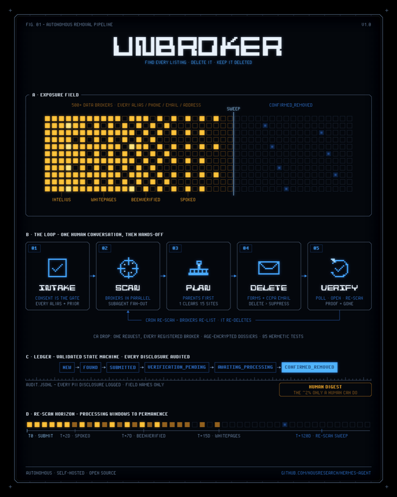

# unbroker

An agent-native skill that finds a consenting person's exposed personal information across data
brokers and people-search sites and removes it. It runs automatically wherever it can, and hands off
to a human only where a site demands a CAPTCHA it cannot clear, a government ID, a phone call, or a
fax.

<p align="center">
  
</p>

## About

Hundreds of data brokers publish people's names, current and prior addresses, phone numbers, emails,
relatives, and property records. That exposure fuels doxxing, stalking, harassment, and identity
theft. Removing the data is the documented antidote, but it is high-volume work, full of dark
patterns, and perishable (brokers re-list you). Commercial services such as EasyOptOuts, Incogni, and
DeleteMe solve this for a fee, but they are closed, and you hand a company you know nothing about the
exact data you are trying to erase.

unbroker brings those core capabilities together (EasyOptOuts' automation breadth, Incogni's
legal-request engine, DeleteMe's verification and reporting) as a transparent, auditable,
self-hosted skill that the user's own agent runs. It is **multi-tenant** (manage yourself, family, or
clients, each isolated), **consent-gated**, and built for **maximum automation with a human
fallback**. Scope is **US-first**, with EU/UK (GDPR) and global coverage on the roadmap.

The design is **Hermes-native**: a small deterministic Python CLI (`scripts/pdd.py`) owns the state
(config, dossiers, broker DB, tier planning, ledger, drafts, reports), while the agent does the
scanning and submitting with native tools (`web_extract`, `browser_*`, email, `cronjob`,
`delegate_task`). [`SKILL.md`](SKILL.md) is the authoritative reference.

## Install

```bash
hermes skills install official/security/unbroker
```

Then start a new Hermes session and drive it (below). The skill works zero-config; a few optional
env vars unlock more automation (all documented in `SKILL.md` under Prerequisites):

- `BROWSERBASE_API_KEY`: the recommended default browser. A real residential-IP cloud browser that
  clears soft/managed CAPTCHAs (Turnstile, hCaptcha/reCAPTCHA checkbox) as normal operation, so
  those brokers stay automated. It is not a solver and does not defeat hard challenges.
- Hands-off email, two ways: **browser mode** (`pdd.py setup --email-mode browser`, no stored
  password; the agent sends opt-outs and opens verification links through your logged-in webmail),
  or **`EMAIL_ADDRESS` + `EMAIL_PASSWORD`** for SMTP send + IMAP verification. Without either, it
  falls back to writing drafts for you to send.
- the `age` binary: at-rest encryption of dossiers and ledgers.
- the `google-workspace` skill: a shared Google Sheets status tracker.

## Usage

Drive it from a Hermes session:

> "Use the unbroker skill to remove my data from data brokers. Here is my consent. Run it hands-off
> and show me the human-task digest at the end."

The agent configures itself (`setup --auto` selects programmatic email if `EMAIL_*` creds exist, the
cloud browser if available, and encryption if `age` is installed), records your consent, then drains
the autonomous queue: scan, opt out (parents first), send and verify emails, schedule re-checks. You
hear from it twice: at intake, and with one digest of anything only a human can do.

The underlying CLI (run via `terminal`, as `python3 scripts/pdd.py <cmd>`):

| Command | Purpose |
|---|---|
| `pdd.py setup --auto` / `doctor` | Self-configure (most-autonomous valid config) and readiness check |
| `pdd.py intake` | Create a consenting subject (captures aliases, multiple emails/phones, prior addresses) |
| `pdd.py next` | The loop driver: ordered agent actions right now, the human digest, and the next wake time |
| `pdd.py brokers` / `refresh-brokers` | List people-search brokers, or pull the latest BADBOOL list plus the CA registry |
| `pdd.py registry` | State data-broker registry coverage (CA ~545 ingested; VT/OR/TX portals); `--search` to find one |
| `pdd.py drop` | The CA DROP one-shot: delete from all registered brokers in a single request |
| `pdd.py plan` | Per-broker tier, method, search vectors, and the exact fields to disclose |
| `pdd.py fanout` | Batch brokers into parallel `delegate_task` subagents |
| `pdd.py record` | Update the ledger (validated state machine); auto-stamps recheck dates |
| `pdd.py send-email` | Render and send an opt-out / CCPA / GDPR request (recipient locked to the broker's own address) |
| `pdd.py poll-verification` / `verify-link` | Resolve email-verification links (IMAP poll, or browser-mode from pasted text) |
| `pdd.py render-email` | Draft-only fallback (least-disclosure) |
| `pdd.py due` / `tasks` | Recheck queue for cron, and the consolidated human-task digest |
| `pdd.py status` / `report` | Per-subject status, plus optional Google Sheets rows |

## How it works

- **Autonomous by default.** After one human conversation (intake plus consent), the agent drains a
  deterministic action queue (`pdd.py next`): scan, opt out parents-first, send and verify emails,
  re-check on schedule, all without pausing to ask. Human-only work (gov-ID sites, phone callbacks,
  hard-CAPTCHA sites) accumulates silently into a single end-of-run digest (`pdd.py tasks`).
- **Tiered automation (T0 to T3).** Every broker opt-out is classified from fully automated, to
  automated with verification, to human-verified, to human-only. The agent always takes the highest
  viable tier and escalates to a human task only when genuinely blocked.
- **Cluster parents first.** Many brokers are resold shells of a few parents, so one removal can
  clear a dozen child sites. The planner orders parents ahead of standalone listings and ships
  field-verified, per-parent playbooks that usually prefer the **right-to-delete** lane over mere
  suppression (for example Whitepages' privacy email, which sidesteps the phone-callback tool), with
  per-broker exceptions where the record says otherwise (PeopleConnect: deleting your user data wipes
  your suppressions and does not stop public-records re-listing, so suppress-and-maintain instead).
- **Multi-identifier fan-out.** A person is indexed under every name/alias, phone, email, and
  address. The planner expands all of them (filtered by what each broker supports) so listings under
  a maiden name or an old address are found, not just "primary name plus current city".
- **Verify before you disclose.** Nothing is submitted until a real listing is confirmed, the match
  is confirmed as the subject and not a namesake or relative, and only the exact fields a broker
  requires are sent (least-disclosure; SSN and ID numbers are never volunteered).
- **Jurisdiction-aware.** Requests file under the framework that applies where the subject lives:
  CCPA/CPRA in California, GDPR in the EU/UK, a general right-to-delete request otherwise. It never
  cites a right the subject cannot invoke.
- **Coverage that matches or exceeds commercial services.** Two lanes: (1) people-search sites with
  per-site opt-out mechanics (19 curated records, including FamilyTreeNow, Radaris, and Nuwber, plus
  a live pull from [BADBOOL](https://github.com/yaelwrites/Big-Ass-Data-Broker-Opt-Out-List)), and
  (2) the **state data-broker registries** as a distinct legal-coverage lane: the **California Data
  Broker Registry** (~545 registered brokers, the authoritative universe the commercial services draw
  from) is ingested, with Vermont, Oregon, and Texas surfaced as search portals.
- **The DROP one-shot.** California's Delete Request and Opt-out Platform is live: for a CA resident,
  a single verified request deletes their data from **every registered broker at once**, and
  `pdd.py next` surfaces it as the highest-leverage action.
- **Ledger, audit, and re-scan.** Every case is a validated state machine, every PII disclosure is
  logged (field names only), and confirmed removals are re-scanned on a schedule so a re-listing is
  caught and re-filed. Ledger writes are file-locked for safe concurrent runs.
- **Privacy by default.** Opaque subject ids (no name in ids, paths, or logs), optional `age` at-rest
  encryption of dossiers, and everything local. The skill ships placeholder data only.

## Tests

85 hermetic tests (no network, browser, or email; SMTP and IMAP are exercised through injected
fakes):

```bash
scripts/run_tests.sh tests/skills/test_unbroker_skill.py           # CI-parity harness
python3 tests/skills/test_unbroker_skill.py                        # dependency-free fallback runner
```

## Safety and ethics

- **Consent-gated.** The engine refuses to scan or act on a subject without a recorded
  authorization. It is a removal tool, not a people-search aggregator.
- **Sanctioned browser only, no solver farms.** The default cloud browser clears soft/managed
  CAPTCHAs the way any real browser would, but there is no CAPTCHA-solving service and no fingerprint
  spoofing. Hard interactive challenges escalate to a human task.
- **Least-disclosure and honest reporting.** The skill submits only what a broker requires. "Hidden
  from free search" is never reported as "deleted", and residual exposure (public records, paid-tier
  retention) is disclosed.
- **PII handling.** Dossiers live under the Hermes home directory (`0600`, optionally
  `age`-encrypted), with opaque ids.

## Status

**v1.0.** The deterministic engine, the autonomous loop, the verified cluster-parent deletion lanes,
and full broker-registry coverage (the CA Data Broker Registry plus the DROP one-shot) are built and
covered by 85 hermetic tests. The skill ships placeholder data only. Live agent-driven submission
against broker sites is the active field-testing frontier.

## Credits and license

- Broker dataset adapted from the **Big-Ass Data Broker Opt-Out List (BADBOOL)** by **Yael Grauer**,
  licensed [CC BY-NC-SA 4.0](https://creativecommons.org/licenses/by-nc-sa/4.0/) (attribution
  required, non-commercial). See [yaelwrites.com](https://yaelwrites.com/).
- Code: MIT.

## Disclaimer

This is not legal advice. Only operate on people who have authorized removal of their own data.
Removing data from brokers reduces exposure but does not guarantee total erasure. Public records
(voter, property, court) and offline vectors are out of scope.
